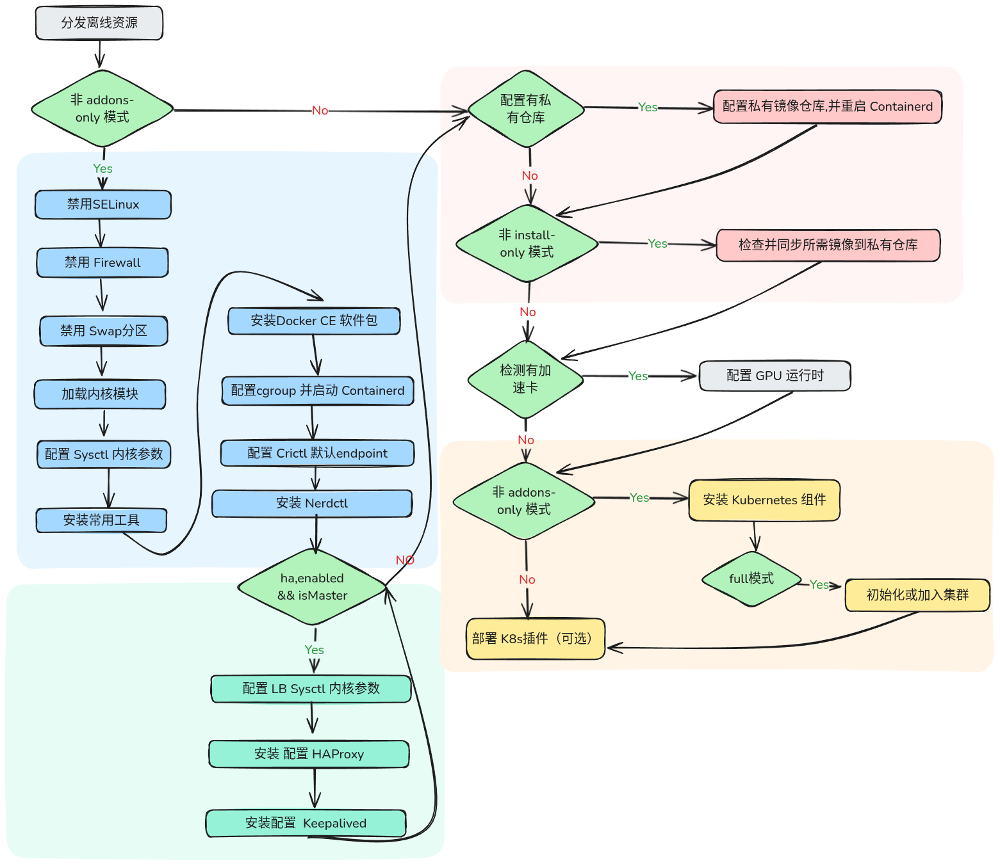

# k8s-offline-tool

该项目用于在离线或内网环境中安装 Kubernetes，并可在已有集群中部署常用插件。工具通过 SSH 连接目标节点，分发离线资源并执行check/部署步骤。

## 功能概览

- 离线安装基础组件：linux通用工具包、docker-ce、containerd、 runc、 nerdctl、加速卡docker-runtime、kubeadm/kubelet/kubectl。 
- 常规配置下会在 master 节点初始化集群，并自动生成 worker 的 join command。若配置中没有master节点，需手动配置worker 节点的 join command。
- 支持私有镜像仓库，程序会自动识别私有镜像仓库配置并替换部署文件相应镜像配置。
- 支持预检查模式`dry_run`，在目标节点环境中检查各安装步骤是否需要执行，不会执行安装动作。
- 支持安装模式选择，
  - 从零安装并初始化集群`full`
  - 在已有集群中仅部署k8s插件 `addons-only` 
  - 仅安装基础环境与软件包，不执行集群初始化`pre-init`
- 支持三主高可用模式，在配置中指定虚拟 IP，程序会自动安装并配置haproxy和keepalived，以三主高可用的方式部署集群。

## 配置说明

### 全量配置示例

```yaml
# 全局 SSH 默认设置
ssh_port: 22
user: "root"

# 本地离线软件包路径
resource_package: "/tmp/resources-openEuler-arm64.tar.gz"

# 命令执行超时（秒）
command_timeout_seconds: 600

# 安装模式：
# - full: 从零安装并初始化集群
# - addons-only: 在已有集群中仅部署k8s组件
# - pre-init: 仅安装基础环境与软件包，不执行初始化
install_mode: "full"

# 软件版本定义
versions:
  dockerce: "29.2.0"
  containerd: "2.2.1"
  runc: "1.3.4"
  nerdctl: "2.2.1"
  k8s: "1.34.4"

# 组件部署配置（默认不启用）
addons:
  kube_ovn:
    enabled: false
    version: "1.15.2"
  multus_cni:
    enabled: false
    version: "snapshot-thick"
  hami:
    enabled: false
    version: "2.8.0"
  kube_prometheus_stack:
    enabled: false
    version: "81.6.0"

# 仅执行预检查，不执行安装动作
dry_run: true

# 私有仓库配置（可选）
registry:
  endpoint: "jusuan.io"
  port: 8080
  ip: 10.10.10.250
  username: "admin"
  password: "Harbor12345"

# 三 Master 高可用配置
ha:
  enabled: true
  virtual_ip: "192.168.1.100/24"


# 节点列表（按顺序进行安装）
nodes:
  - ip: "10.10.10.50"
    password: "root"
    ssh_port: 22
    is_master: true
    is_primary_master: true
    interface: "ens18"
  - ip: "10.10.10.51"
    password: "root"
    ssh_port: 22
    is_master: true
    interface: "ens18"
  - ip: "10.10.10.52"
    password: "root"
    ssh_port: 22
    is_master: true
    interface: "ens18"
  - ip: "10.10.10.60"
    password: "root"
    ssh_port: 22
  - ip: "10.10.10.61"
    password: "root"
    ssh_port: 22
  - ip: "10.10.10.70"
    password: "root"
    ssh_port: 22


# Worker 节点加入集群的命令 (在 is_master: false 的节点上执行)
join_command: "kubeadm join 192.168.1.10:6443 --token <token> --discovery-token-ca-cert-hash <hash>"
# 子Master 节点加入集群的命令 (在 is_master: true,is_primary_master: false 的节点上执行)
master_join_command: ""
```

### 字段解释与默认值

#### 顶层字段

| 字段 | 必填 | 默认值  | 说明                                                                                    |
| -- |----|------|---------------------------------------------------------------------------------------|
| `ssh_port` | 否  | `22` | SSH 端口默认值，可被节点级配置覆盖。                                                                  |
| `user` | 否  | `root` | SSH 用户名。                                                                              |
| `command_timeout_seconds` | 否  | `600` | 远程命令执行超时（秒）。                                                                          |
| `install_mode` | 否  | `full` | 安装模式：`full` 为从零安装集群，`addons-only` 为仅部署k8s插件, `pre-init` 为仅安装基础组件与 K8s 软件包，不执行集群初始化及插件安装 |
| `dry_run` | 否  | `false` | 仅执行预检查，不执行安装动作。                                                                       |
| `versions` | 否  | 见下表  | 离线包版本配置。                                                                              |
| `addons` | 否  | 见下表  | 插件启用与版本配置。                                                                            |
| `registry` | 否  | 空    | 私有镜像仓库配置（Harbor），启用后会同步重写镜像配置。                                                        |
| `nodes` | 是  | 见下表  | 节点列表                        |
| `join_command` | 否  | 空    | worker 加入集群时使用的命令。若未指定，会在 master 初始化后自动生成。                                            |
| `master_join_command` | 否  | 空    | 子Master 节点加入集群时使用的命令。若未指定，会在 master 节点初始化后自动生成。                                       |
| `ha` | 否  | 空    | 三 Master 高可用配置。                                                                       |
| `resource_package` | 是  |  | 本地离线软件包路径                                                             |
#### `versions`（支持版本）

| 字段            | 必填   | 默认值      | 说明            |
|---------------| -----|----------|---------------|
| `dockerce`    | 否      | `29.2.0` | docker-ce 版本  |
| `containerd` | 否  | `2.2.1`  | containerd 版本。 |
| `runc`       | 否  | `1.3.4`  | runc 版本。      |
| `nerdctl`    | 否  | `2.2.1`  | nerdctl 版本。   |
| `k8s`        | 否  | `1.34.4` | Kubernetes 版本。 |

#### `addons`（支持版本）
后续持续添加适配其他必要组件，部署方式大多采用helm离线包部署，少数为纯yaml文件。

**注意：** 目前仅插件：kube_ovn、multus_cni能在full模式下启用安装。
其它插件均只能在addons-only模式下才能启用安装。

| 字段 | 默认值              | 说明                        |
| --- |------------------|---------------------------|
| `kube_ovn.enabled` | `false`          | 是否部署 kube-ovn。            |
| `kube_ovn.version` | `1.15.0`         | kube-ovn 版本。              |
| `multus_cni.enabled` | `false`          | 是否部署 multus-cni。          |
| `multus_cni.version` | `snapshot-thick` | multus-cni 版本。            |
| `hami.enabled` | `false`          | 是否部署 hami、hami-webui      |
| `hami.version` | `2.7.1`          | hami 版本。                  |
| `kube_prometheus_stack.enabled` | `false`          | 是否部署 kube-prometheus-stack。 |
| `kube_prometheus_stack.version` | `81.6.0`         | kube-prometheus-stack 版本。 |

#### `registry`

| 字段 | 必填 | 说明                            |
| --- |----|-------------------------------|
| `endpoint` | 是  | Harbor 域名（http）。               |
| `port` | 是  | Harbor 端口。                     |
| `ip` | 是  | Harbor 的 IP，用于写入 `/etc/hosts`。 |
| `username` | 是  | Harbor 用户名，用于创建项目和查询镜像。 |
| `password` | 是  | Harbor 密码。 |


#### `nodes`
| 字段 | 必填 | 默认值  | 说明               |
| --- |----|------|------------------|
| `ip` | 是  | -    | 节点 IP            |
| `password` | 是  | -    | 节点登录密码。          |
| `ssh_port` | 否  | 22   | SSH 端口，默认为 `22`。 |
| `is_master` | 否  | false | 是否为 master 节点。   |
| `is_primary_master` | 否  | false | 是否为主 master 节点。  |
| `interface` | 否  | -    | 节点管理网卡名称，ha模式下必填 |


#### `ha`
ha 模式开启时，要求配置3个master节点，其中一个为主 master 节点。

| 字段 | 必填 | 默认值 | 说明 |
| --- |----|-----|----------------|
| `enabled` | 是  | true | 是否启用高可用        |
| `virtual_ip` | 是  | -   | 三主高可用虚拟 IP     |


## 操作系统以及内核版本支持清单
后续持续添加适配其它操作系统及内核

| 操作系统 | 内核版本                   |
| -- |------------------------|
| Ubuntu 24.04 | 6.8.0-90-generic       |
| Fedora Linux 41 | 6.11.4-301.fc41.x86_64 |
| openEuler 22.03 L~~TS | 5.10.~~0-60.18.0.50.oe2203.aarch64      |

## 加速卡支持
后续持续添加适配其他厂商的加速卡
* nvidia
* Ascend npu

程序会自动识别对应节点是否存在加速卡，然后自动安装对应加速卡的容器运行时工具。

| 名称 | 版本 |
| ------------ | --------- |
| nvidia-container-toolkit | 1.18.2-1 |
| Ascend-docker-runtime | 7.3.0 |

插件部署环节会部署hami、hami-webui以及ascend-device-plugin

| 名称 | 版本 |
| ------------ | --------- |
| hami | 2.7.1 |
| hami-webui | 1.0.5 |
| ascend-device-plugin | v1.2.0 |


## 基础工具列表
程序执行时，会在系统中安装如下附加的基础工具：

* fedora 41 
  * 监控类：htop
  * 下载类：dnf-plugins-core
  * 网络类：iproute-tc、NetworkManager-tui

* ubuntu 24.04
  * 下载类：apt-transport-https
  * 视图：tree

* openEuler 22.03 LTS
  * 不需要安装基础工具
  

## 使用方式

```bash
# 编译
go build -o k8s-offline-tool main.go
```

```bash
./k8s-offline-tool -config xxx.yaml
```

## 安装步骤解析





## 使用场景
配置示例见：[config.yaml](example/config.yaml)、[config-ha.yaml](example/config-ha.yaml)

### 场景一：离线环境完整安装 Kubernetes 集群
按顺序部署节点，安装基础工具、容器运行时、配置私有镜像仓库、Kubernetes 安装、插件安装，并在第一个 master 节点初始化集群，其他节点加入集群
```bash
root@f1:~# cat config.yaml 
registry:
  endpoint: "jusuan.io"
  port: 8080
  ip: 192.168.1.7
  username: "admin"
  password: "Harbor12345"
nodes:
  - ip: "192.168.1.8"
    password: "root"
    is_master: true
  - ip: "192.168.1.10"
    password: "root"
  - ip: "192.168.1.3"
    password: "root"
addons:
  kube_ovn:
    enabled: true
  multus_cni:
    enabled: true
  hami:
    enabled: true
  kube_prometheus_stack:
    enabled: true
    
# 仅执行预检查，正式安装前可先执行预检查模式看看
# dry_run: true 
root@f1:~# ./k8s-offline-tool -config config.yaml
```

### 场景二：在已有集群中部署常用插件
该模式下，仅在已存在集群上部署插件，插件可以选择性安装
```bash
root@f1:~# cat config.yaml 
install_mode: "addons-only"
registry:
  endpoint: "jusuan.io"
  port: 8080
  ip: 192.168.1.7
  username: "admin"
  password: "Harbor12345"
nodes:
  - ip: "192.168.1.8"
    password: "root"
    is_master: true
  - ip: "192.168.1.10"
    password: "root"
  - ip: "192.168.1.3"
    password: "root"
addons:
  kube_ovn:
    enabled: true
  multus_cni:
    enabled: false
  hami:
    enabled: true
  kube_prometheus_stack:
    enabled: true
root@f1:~# ./k8s-offline-tool -config config.yaml
```

### 场景三：仅安装基础工具和 k8s 组件 (pre-init)，不执行 kubeadm init/join 及插件安装
且没有配置私有镜像仓库
```bash
root@f1:~# cat config.yaml 
install_mode: "pre-init"
nodes:
  - ip: "192.168.1.8"
    password: "root"
    is_master: true
  - ip: "192.168.1.10"
    password: "root"
  - ip: "192.168.1.3"
    password: "root"
root@f1:~# ./k8s-offline-tool -config config.yaml
```

### 场景四： 将目标work节点加入已存在集群
如有私有镜像仓库，请配置 `registry` 参数
```bash
root@f1:~# cat config.yaml 
install_mode: "full"
nodes:
  - ip: "192.168.1.10"
    password: "root"
  - ip: "192.168.1.3"
    password: "root"
join_command: "kubeadm join xxxx"
root@f1:~# ./k8s-offline-tool -config config.yaml
```


## 📦 运行示例

高可用集群安装
<p align="center">
  
</p>


addons-only模式安装插件
<p align="center">
  
</p>


## 注意事项
私有镜像仓库镜像同步步骤的执行是在本程序运行的本地环境中进行的，确保本地环境可以访问配置的私有仓库。附上配置示例：
### docker
```bash
cat <<EOF > daemon.json
{
  "registry-mirrors": ["https://hdi5v8p1.mirror.aliyuncs.com"],
  "exec-opts": ["native.cgroupdriver=systemd"],
  "insecure-registries" : [ "jusuan.io:8080"]
}
EOF
mv daemon.json /etc/docker/

systemctl enable docker.service
sudo systemctl daemon-reload
systemctl restart docker.service
```

### containerd 2.2版本+
```bash
containerd config default > /etc/containerd/config.toml
sudo sed -i 's/SystemdCgroup = false/SystemdCgroup = true/g' /etc/containerd/config.toml
sudo sed -i "s|config_path = '/etc/containerd/certs.d:/etc/docker/certs.d'|config_path = '/etc/containerd/certs.d'|g" /etc/containerd/config.toml

sudo mkdir -p /etc/containerd/certs.d/jusuan.io:8080
sudo tee /etc/containerd/certs.d/jusuan.io:8080/hosts.toml >/dev/null <<'EOF'
server = "http://jusuan.io:8080"

[host."http://jusuan.io:8080"]
  capabilities = ["pull", "resolve", "push"]
EOF

systemctl enable containerd.service
sudo systemctl daemon-reload
systemctl restart containerd.service
```


## TODO
* 持续添加适配其它操作系统、架构及内核。
* 持续添加适配其它国产加速卡的驱动、固件、容器运行时工具的检测与安装。
* 持续添加适配其它k8s插件。
* 适需求添加适配k8s版本的升级。


